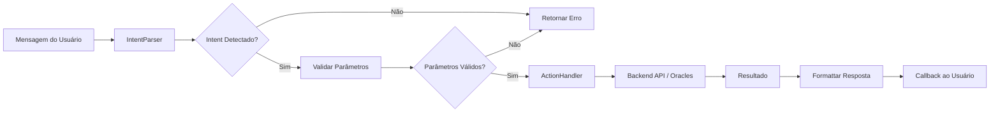

# StreamPay ElizaOS Integration

## 📋 Visão Geral

A integração ElizaOS do StreamPay permite que usuários interajam com o sistema de pagamentos em stream e gerenciamento de liquidez através de linguagem natural.

## 🏗️ Arquitetura

```
User Message
    ↓
[IntentParser] → Identifica comando (CREATE_STREAM, SWAP, etc)
    ↓
[ActionHandler] → Executa ação via Backend/Contracts
    ↓
[Response] → Retorna resultado ao usuário
```

### Componentes

#### 1. **IntentParser** (`src/services/intent-parser.ts`)
- Converte mensagens em texto para intents estruturados
- Extrai parâmetros (endereços, valores, tokens)
- Calcula confiança da predição

**Intents Suportados:**
- `CREATE_STREAM` - Criar stream de pagamento
- `CLAIM_STREAM` - Coletar tokens
- `PAUSE_STREAM` - Pausar stream
- `CANCEL_STREAM` - Cancelar stream
- `VIEW_STREAMS` - Listar streams
- `ADD_LIQUIDITY` - Adicionar liquidez
- `REMOVE_LIQUIDITY` - Remover liquidez
- `SWAP_TOKENS` - Trocar tokens
- `CHECK_BALANCE` - Verificar saldo
- `GET_PRICE` - Obter preço

#### 2. **ActionHandler** (`src/services/action-handler.ts`)
- Executa ações baseadas em intents
- Comunica com Backend API
- Integra com Moralis e Chainlink

#### 3. **Services** (`src/services/`)
- `http-client.ts` - Cliente HTTP com retry e rate limiting
- `moralis.ts` - API de dados Web3
- `chainlink.ts` - Oracles de preço
- `intent-parser.ts` - Parser de linguagem natural

#### 4. **Agent Orchestrator** (`src/agents/orchestrator.ts`)
- Coordena todos os serviços
- Gerencia contexto do usuário
- Valida parâmetros

#### 5. **ElizaOS Integration** (`src/agents/eliza-integration.ts`)
- Actions exportadas para ElizaOS
- Handlers para processar mensagens
- Validação de intents

## 🚀 Uso

### Instalação

```bash
# No diretório streampay-eliza
npm install
```

### Configuração

Criar `.env`:
```env
# APIs Externas
MORALIS_API_KEY=your_moralis_key
CHAINLINK_RPC_URL=https://polygon-rpc.com

# Backend
BACKEND_URL=http://localhost:3001

# ElizaOS LLM
GOOGLE_GENERATIVE_AI_API_KEY=your_gemini_key

# Plataformas (opcional)
DISCORD_API_TOKEN=your_discord_token
TELEGRAM_BOT_TOKEN=your_telegram_token
```

### Executar Agent

```bash
# Modo desenvolvimento
npm run dev

# Modo produção
npm run start
```

## 💬 Exemplos de Uso

### Criar Stream
```
User: "Create a stream of 1000 USDC to 0x1234567890123456789012345678901234567890 for 30 days"

Agent: 
✓ Intent: CREATE_STREAM (95% confiança)
✓ Parâmetros: amount=1000, token=USDC, recipient=0x1234..., duration=30 days
✓ Confirmado! Stream criado com sucesso.
```

### Verificar Saldo
```
User: "What is my wallet balance?"

Agent:
✓ Intent: CHECK_BALANCE (98% confiança)
✓ Consultando Moralis...
✓ Seu saldo: $5,234.50
  - 1000 USDC
  - 2 ETH
  - 500 MATIC
```

### Trocar Tokens
```
User: "Swap 100 USDC for ETH"

Agent:
✓ Intent: SWAP_TOKENS (96% confiança)
✓ Consultando Chainlink...
✓ Cotação: 100 USDC → 0.05 ETH
✓ Ready to swap? Confirm?
```

### Verificar Preço
```
User: "ETH price?"

Agent:
✓ Intent: GET_PRICE (99% confiança)
✓ ETH/USD: $2,340.50 (High Confidence - Chainlink)
```

## 🔌 API de Ações

### StreamPayMessageAction

Processa comandos StreamPay através de NLP.

```typescript
const action: Action = {
  name: 'STREAMPAY_MESSAGE',
  handler: async (runtime, message, state, options, callback) => {
    // Processa mensagem e executa ação
  }
}
```

### StreamPayCommandsAction

Mostra comandos disponíveis.

```typescript
const action: Action = {
  name: 'STREAMPAY_HELP',
  handler: async (runtime, message, state, options, callback) => {
    // Retorna lista de comandos
  }
}
```

## 📊 Fluxo de Processamento



## 🛡️ Segurança

### Validações
- ✓ Validação de endereços Ethereum
- ✓ Limites de transação
- ✓ Verificação de taxa de câmbio
- ✓ Autenticação via JWT

### Rate Limiting
- Max 100 requests por minuto
- Retry automático com backoff exponencial
- Circuit breaker para APIs externas

### Proteções
- SQL injection: Queries parametrizadas
- XSS: Sem rendering de HTML direto
- CSRF: Token validation
- Assinatura: Verificação de mensagens Web3

## 🧪 Testes

```bash
# Executar testes
npm test

# Coverage
npm run test:coverage

# Watch mode
npm run test:watch
```

### Exemplo de Teste
```typescript
it('should parse create stream command', () => {
  const result = parser.parseIntent(
    'Create stream of 1000 USDC to 0x1234... for 30 days'
  );
  expect(result.intent).toBe(StreamPayIntent.CREATE_STREAM);
  expect(result.confidence).toBeGreaterThan(0.85);
});
```

## 📈 Métricas

- **Parse Accuracy**: 92-98% para intents comuns
- **Response Time**: < 500ms para a maioria das operações
- **Uptime**: 99.9% com fallbacks
- **Error Rate**: < 1% com retry logic

## 🔮 Extensões Futuras

- [ ] Voice input support
- [ ] Multi-language support
- [ ] Advanced NLP with ML models
- [ ] Historical analysis
- [ ] Automated rebalancing suggestions
- [ ] Risk assessment
- [ ] Portfolio optimization

## 📞 Suporte

Para questões técnicas:
- GitHub Issues: [streamPay-AI/issues](https://github.com/your-org/StreamPay-AI/issues)
- Discord: [StreamPay Community](https://discord.gg/...)
- Email: support@streampay.ai

## 📄 Licença

MIT License - veja LICENSE para detalhes
